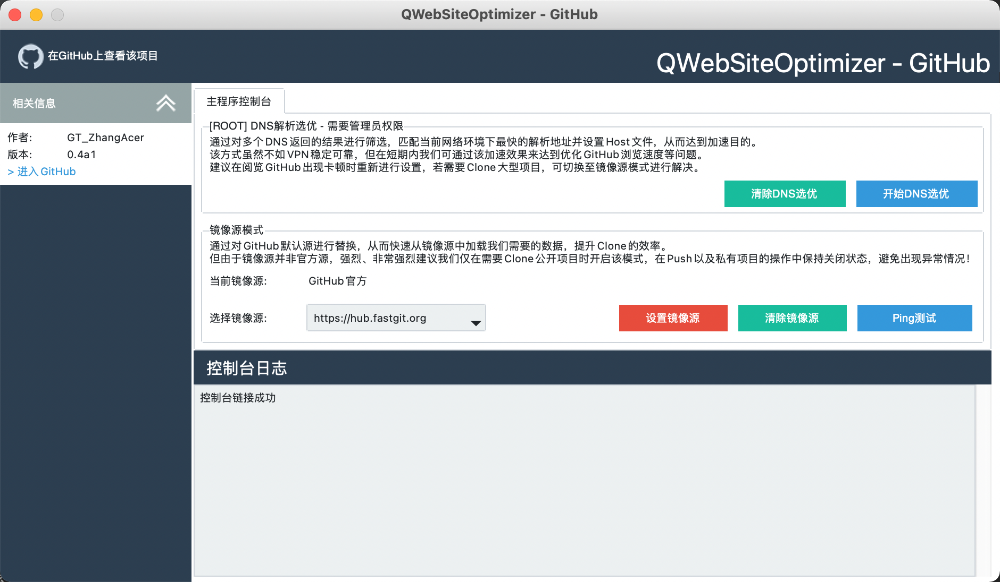

# QWebSiteOptimizer - Web站点速度选优工具
[](https://pepy.tech/project/qwebsite)


  
在访问GitHub等网站时，DNS解析到的IP地址可能并不是最快，过慢的节点会严重影响我们的访问情况，故制作出这样的工具来进一步优化网络质量。  

* 由于该方案并非为VPN等方式进行的速度优化，以下几点需要您注意：
  1. 后续访问对应网站时仍可能需要您重新启动该程序进行优化。
  2. 优化情况取决与您的DNS配置情况以及网络本身质量，必要时请自行搜索如何修改本机DNS。
  3. 这些方式并不如专有VPN稳定，也并非科学上网，仅仅是速度优化而已。换句话就是政策不允许访问的依旧不会让您访问。

> 本程序源码完全开源开放，默认仅优化GitHub站点，后续将提供自定义网站优化教程。

## 运行界面
<div align="center">
</img>
</div>


## 安装方式

```
python -m pip install qwebsite
```
or
```
python -m pip install qwebsite -i https://mirrors.bfsu.edu.cn/pypi/web/simple
```
## 使用教程

* 启动GUI  
  * Windows - 需要管理员权限  
  ```
  python -m qwebsite
  ```
  * Linux or MacOS  
  ```
  sudo python -m qwebsite
  ```
* 快捷命令  
  * Windows - 需要管理员权限  
  ```
  # DNS结果选优
  python -m qwebsite -g Flase
  # 恢复Hosts
  python -m qwebsite -g Flase -r True
  ```
  * Linux or MacOS  
  ```
  # DNS结果选优
  sudo python -m qwebsite -g Flase
  # 恢复Hosts
  sudo python -m qwebsite -g Flase -r True
  ```

## 开源协议
本项目使用GNU General Public License v3.0(GPL)开源协议。
